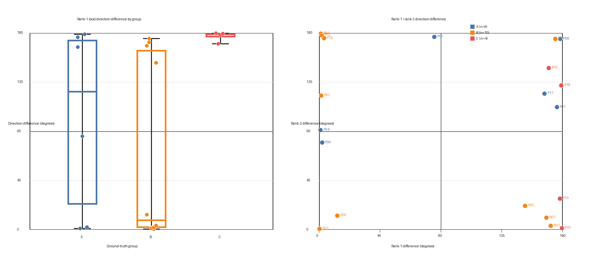

# 分析：方向差分布（バッチ15）

**分析日：2026-08-28／OSM基準：`kanto-260801.osm.pbf`（2026年8月1日固定）**

## 0. 結論

**判定は (b)。B群とC群の方向差は重なっており、方向照合だけで両者を区別できない。この対策は採用しない。**

- 第1候補の方向差は、B群10点が **0.408–174.722°**（中央値 **8.634°**）、C群4点が **169.909–179.578°**（中央値 **178.653°**）である（`bicycle-navi/backend/data/direction_difference_summary.json:30-55`）。範囲は **169.909–174.722°** で重なる（同JSON `:67-68`）。
- B群のうち現行rank1も逆向きとなる4点は **152.421–174.722°**。このうちP11の174.722°はC群の範囲内にある（明細は `bicycle-navi/backend/data/direction_difference_points.csv:8-17`、C群は同 `:18-21`）。
- 第2候補まで使い「第1候補≥90°・第2候補<90°」を見ても、B群の3点だけでなくC群の2点が同じ領域に入る。「両候補とも90°以上」もB群1点・C群2点で重なる（同JSON `:71-89`）。第1・第2候補の組み合わせでも区別できない。
- 直接参照するpolyline点が5m未満だった点は **0/20点**。したがって、さらに前後へ遡って方向を計算した点も **0点**である（同JSON `:69-70`）。

## 1. 対象と方法

### 1.1 対象

単に「20点」ではなく、**旧方式で検出された16way・18点、および現行方式で新規に検出された2way・2点の、計18way・20点**。内訳はA群6点・B群10点・C群4点である（`bicycle-navi/backend/data/direction_difference_summary.json:2-7`）。

点ID・群・座標は `docs/検証記録/検証記録_18点.md` と `docs/検証記録/検証記録_新規2点.md` から機械的に読み取り、`verify_match_margin_points.csv` の座標と一意に対応づけた。各点の元記録行とCSV行は `bicycle-navi/backend/data/direction_difference_points.csv:2-21` の `record_source` / `verify_source` 列に保存した。

### 1.2 方向差の算出

- **進行方向**：Googleのraw polylineの直前点から当該点への初期方位角。始点は当該点から直後点を使った。直接参照点が5m未満の場合は同じ方向の外側の点まで延長する規則とした（`bicycle-navi/backend/data/direction_difference_summary.json:8`）。
- **way方向**：way全体の始終点ではなく、判定点に最も近い有限線分の始点→終点の初期方位角。最近傍線分は本番の `services.overpass._point_to_way_dist_m` で選び、分析側で別の距離関数を実装していない（同JSON `:9`）。
- **第1・第2候補**：既存の `verify_match_margin_points.csv` に記録された有限線分距離rank1/rank2を使用した。候補選択に方向情報は使用していない。
- **判定関数の再利用**：分析スクリプトは `services.law_checker.check_oneway_violation` も import し、各rank候補に同じ進行ベクトルを与えた判定結果をCSVへ保存した。判定ロジックの再実装や変更は行っていない。
- **統計量**：四分位数は昇順値の `(n-1)p` 位置を線形補間した（同JSON `:10`）。

## 2. 群別分布

### 2.1 第1候補の方向差

| 群 | n | 最小 | 25% | 中央値 | 75% | 最大 |
|---|---:|---:|---:|---:|---:|---:|
| A | 6 | 1.104° | 23.038° | 126.029° | 173.639° | 178.519° |
| B | 10 | 0.408° | 1.726° | 8.634° | 164.214° | 174.722° |
| C | 4 | 169.909° | 176.091° | 178.653° | 179.261° | 179.578° |

出典：`bicycle-navi/backend/data/direction_difference_summary.json:12-20`, `:30-38`, `:48-56`。

### 2.2 第2候補の方向差

| 群 | n | 最小 | 25% | 中央値 | 75% | 最大 |
|---|---:|---:|---:|---:|---:|---:|
| A | 6 | 79.615° | 96.318° | 118.243° | 161.948° | 176.339° |
| B | 10 | 0.614° | 11.481° | 72.269° | 174.851° | 179.370° |
| C | 4 | 1.456° | 21.726° | 80.180° | 135.870° | 147.845° |

出典：`bicycle-navi/backend/data/direction_difference_summary.json:21-28`, `:39-46`, `:57-64`。

画像の生成元：`bicycle-navi/backend/data/direction_difference_points.csv:2-21`。画像ファイル：`bicycle-navi/backend/data/direction_difference_distribution.png`。

### 2.3 当初予想との照合

- **B群**：10点全体が180°付近に集中する予想は支持されなかった。有限線分距離により現行rank1が順方向側へ変わった旧B群点を含むため、分布は0°付近と逆方向側の二峰性になった。
- **C群**：4点は169.909–179.578°で、真の違反も局所way方向と逆向きに走っている予想を支持した。
- **A群**：0°付近に集中する予想は支持されなかった。A群は「OSM上のway方向に順走」という群ではなく、現地で自転車除外があるのにOSMへ反映されていない群である。そのため、幾何的には逆向きの点が含まれる。さらに現行rank1が旧検出wayから変わった点も含む。

## 3. B-3の判定

B群とC群の第1候補範囲は重なる。特に方向照合が操作したい「逆向きrank1」に限定しても、B群P11の174.722°はC群の169.909–179.578°内にある（`bicycle-navi/backend/data/direction_difference_points.csv:14`, `:18-21`）。

したがって、方向差90°等で逆向き候補を除外・減点すると、B群の誤対応だけでなくC群の真の違反も同じ条件に入る。**(b)「分布が重なっている」と判定し、方向照合は採用しない。**

## 4. B-4：第1候補と第2候補の組み合わせ

90°を「順向き／逆向き」の事前基準とし、rank1/rank2の組み合わせを数えた。

| 群 | rank1≥90・rank2<90 | rank1≥90・rank2≥90 | rank1<90・rank2<90 | rank1<90・rank2≥90 |
|---|---:|---:|---:|---:|
| A | 0 | 3 | 1 | 2 |
| B | 3 | 1 | 2 | 4 |
| C | 2 | 2 | 0 | 0 |

出典：`bicycle-navi/backend/data/direction_difference_summary.json:71-89`。

B群で想定した「rank1は逆向き、rank2は順向き」はN01・N02・P05の3点で見られたが、C群でもP10・P13の2点が同じ領域に入った（`bicycle-navi/backend/data/direction_difference_points.csv:8-9`, `:12`, `:18`, `:20`）。またP11（B）とP12/P18（C）は両候補が90°以上の領域で重なる（同CSV `:14`, `:19`, `:21`）。

よって、第2候補の方向差を加えてもB群とC群は区別できない。またP11の第2候補は歩道wayであり、既存の注意どおり第2候補が正解wayとは限らない（同CSV `:14`）。

## 5. 成果物と再現性

- 分析スクリプト：`bicycle-navi/backend/scripts/analyze_direction_difference.py`
- 20点明細CSV：`bicycle-navi/backend/data/direction_difference_points.csv`
- 集計JSON：`bicycle-navi/backend/data/direction_difference_summary.json`
- 分布画像：`bicycle-navi/backend/data/direction_difference_distribution.png`

分析スクリプトは生データや判定ロジックを変更せず、分析CSV・JSON・画像のみを生成する。

## 6. 実装方針文書の扱い

B-3が (b) のため、`docs/構成/実装方針_方向照合.md` は作成しない。方向差による候補除外・減点の実装には進まない。
